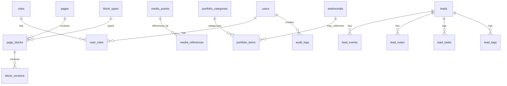

# PRD – Sarit Hadar (Placeholder) | אתר פרימיום + Backoffice דרגה 3 (CMS + Leads CRM + Analytics)

> הערה: השם "Sarit Hadar" וכל פרטי הקשר הם placeholders. להחליף לנתונים האמיתיים של הלקוחה לפני עליה לאוויר.

---

## תוכן עניינים

1. [תקציר](#1-תקציר-executive-summary)
2. [מטרות עסקיות](#2-מטרות-עסקיות)
3. [קהל יעד](#3-קהל-יעד)
4. [הצעת ערך](#4-הצעת-ערך-value-proposition)
5. [עקרונות סגנון](#5-עקרונות-סגנון-חובה)
6. [Scope](#6-scope)
7. [IA – ארכיטקטורת מידע](#7-ia--ארכיטקטורת-מידע)
8. [Roles & Permissions (RBAC)](#8-roles--permissions-rbac)
9. [Public Site – דרישות פונקציונליות](#9-public-site--דרישות-פונקציונליות)
10. [Backoffice – דרישות פונקציונליות (דרגה 3)](#10-backoffice--דרישות-פונקציונליות-דרגה-3)
11. [מדיה מומלצת](#11-מדיה-מומלצת-לפי-המדיניות)
12. [טכנולוגיה מומלצת](#12-טכנולוגיה-מומלצת)
13. [אבטחה ונגישות](#13-אבטחה-ונגישות)
14. [אירועים (Tracking Events)](#14-אירועים-tracking-events)
15. [מודל נתונים (DB) + ERD](#15-מודל-נתונים-db--erd-mermaid)
16. [Seed Content (תוכן מלא לאתר)](#16-seed-content-תוכן-מלא-לאתר--להכניס-כנתוני-התחלה-בcms)
17. [קריטריוני קבלה](#17-קריטריוני-קבלה-acceptance-criteria--חובה)
18. [ENV Template](#18-env-template-placeholders-בלבד)
19. [הערות יישום](#19-הערות-יישום)

---

## 1. תקציר (Executive Summary)

נבנה אתר תדמיתי־מכירתי פרימיום לכותבת תוכן ועריכת לשון, שמטרתו לייצר פניות איכותיות דרך WhatsApp/טפסים, להציג תיק עבודות והוכחות, ולשדר אמינות וסדר.

בנוסף, נבנה **פאנל ניהול מקיף (דרגה 3)** שמאפשר ללקוחה לנהל עצמאית תכנים, מדיה, תיק עבודות, לידים, וניתוח ביצועים מתוך המערכת.

---

## 2. מטרות עסקיות

1) הגדלת פניות איכותיות (WhatsApp + טפסים)
2) בניית אמון מהיר (המלצות, לפני/אחרי, תהליך עבודה ברור)
3) סינון לידים (שאלון "בדיקה מהירה")
4) עצמאות מלאה ללקוחה בניהול האתר דרך Backoffice

### KPIs

- CTR לוואטסאפ: 3%–8%
- המרות טופס: 1%–3%
- 20–40 פניות/חודש, 6–10 שיחות, 3–5 סגירות
- ביצועים: LCP < 2.5s
- SEO ונגישות ברמה גבוהה

---

## 3. קהל יעד

- בעלי עסקים קטנים־בינוניים בישראל: מטפלים, קוסמטיקה, אימון, נדל״ן, סוכנויות רכב, חנויות אונליין קטנות.
- מי שניסה לכתוב לבד/עם AI והטקסט נשמע גנרי או לא מביא פניות.
- מחפשים כתיבה נקייה, אמינה, לא "מילים מפוצצות".

---

## 4. הצעת ערך (Value Proposition)

"טקסט שמסביר בדיוק מה אתם מציעים — ומוביל לפנייה."

כתיבה/עריכת לשון שמייצרת סדר, אמון והנעה לפעולה — בצורה אנושית, נקייה ומדויקת.

---

## 5. עקרונות סגנון (חובה)

### "לא מרגיש AI"

- טון: אנושי, קצר, בטוח, נקי.
- להימנע מקלישאות/אובר־שיווקיות.
- כל מקטע: משפט חד + בולטים קצרים + CTA ברור.
- RTL מלא בכל האתר והפאנל.

### "Hook אמון" מעל הקפל (Hero חייב לכלול)

- מה היא עושה (שורה אחת)
- למי זה מתאים (שורה אחת)
- הוכחה מהירה (ציטוט קצר / לפני־אחרי קצר)
- CTA וואטסאפ + CTA "בדיקה מהירה"

---

## 6. Scope

### MVP (חובה ביום השקה)

**Public Site**

- עמוד בית ארוך (דף נחיתה) עם המקטעים: Hero, בעיה, שירותים, לפני/אחרי, תיק עבודות, תהליך, חבילות, המלצות, FAQ, צור קשר
- עמודים: אודות, שירותים, תיק עבודות, צור קשר, מדיניות פרטיות
- טופס "בדיקה מהירה" + טופס צור קשר
- כפתור WhatsApp צף + CTA בכל אזור
- SEO בסיסי + OG + Schema
- Tracking אירועים (GA4 + פנימי)

**Backoffice (דרגה 3)**

- Auth + Roles + Permissions (RBAC)
- CMS לעמודים ומקטעים (Page Builder "Blocks")
- Media Library
- Portfolio Manager
- Leads CRM מלא (טבלה + קנבן + סטטוסים + תיוג + משימות + תזכורות)
- Analytics Dashboard פנימי (תנועה, מקורות, המרות, משפך)
- Settings + Integrations
- Audit Logs
- Export לידים ל־CSV/XLSX

### שלב 2 (Nice to have)

- בלוג/מאמרים עם SEO מתקדם
- קייס סטאדיז מורחבים (תוצאות)
- קביעת שיחה ביומן (Calendly)
- A/B לעמוד הבית

### Out of scope

- סליקה/חנות מלאה
- מערכת לקוחות מורכבת
- CRM ארגוני מלא מעבר לדרישות

---

## 7. IA – ארכיטקטורת מידע

### Public

- /
- /about
- /services
- /portfolio
- /contact
- /privacy
- /thank-you

### Backoffice

- /admin/login
- /admin/dashboard
- /admin/content/pages
- /admin/content/pages/[id] (Builder)
- /admin/content/articles (אם קיים)
- /admin/content/faq
- /admin/content/testimonials
- /admin/portfolio
- /admin/media
- /admin/leads (table)
- /admin/leads/kanban
- /admin/leads/[id]
- /admin/analytics
- /admin/settings
- /admin/users
- /admin/audit-logs

---

## 8. Roles & Permissions (RBAC)

תפקידים:

- Owner/Admin: הכל
- Editor: תכנים + מדיה + תיק עבודות (בלי משתמשים/אינטגרציות/מחיקות מסוכנות)
- Sales/Leads: ניהול לידים בלבד
- Viewer: קריאה בלבד (Analytics/Leads read-only)

אבטחה:

- איפוס סיסמה במייל
- נעילת חשבון זמנית אחרי ניסיונות כושלים
- Audit Log לכל פעולה משמעותית

---

## 9. Public Site – דרישות פונקציונליות

### ניווט

- תפריט Sticky: בית | שירותים | תיק עבודות | אודות | צור קשר
- CTA ראשי: לוואטסאפ
- CTA משני: "בדיקה מהירה בחינם"

### טפסים

**1) בדיקה מהירה (6–8 שדות, עדיף Multi-step עם progress)**

- שם, טלפון, תחום, מה צריך, קישור קיים (אופציונלי), יעד, דדליין (אופציונלי)
- ולידציה לטלפון ישראלי
- Anti-spam: honeypot + rate limit

**2) צור קשר**

- שם, טלפון, אימייל (אופציונלי), הודעה

### Thank You Page

- לאחר כל שליחה: Redirect ל־/thank-you
- שם: "קיבלתי 🙌 אחזור עד 24 שעות"
- CTA לוואטסאפ נוסף
- אירוע Tracking: submit_* + שמירת UTM

### תיק עבודות באתר

- פילטרים: הכל | דפי נחיתה | תוכן לאתרים | מודעות | עריכת לשון
- כרטיסים עם תבנית קבועה (נישה, האתגר, מה עשינו, תוצאה)
- תמיכה באנונימיות

---

## 10. Backoffice – דרישות פונקציונליות (דרגה 3)

### 10.1 CMS (Pages + Blocks Builder)

- Pages CRUD
- לכל עמוד: רשימת Blocks
- יכולות: add/remove, reorder (drag & drop), hide/show, edit content, preview
- Draft / Publish
- Versioning בסיסי (שחזור לגרסה קודמת לפחות 1–3)

**Block Types:**

- Hero
- Text + Bullets
- Cards (services/benefits)
- Before/After (text or image)
- Testimonials
- FAQ
- CTA Banner
- Portfolio Grid
- Form Embed
- Video Block
- Metrics

### 10.2 Media Library

- Upload תמונות/וידאו/קבצים
- שמירה: filename, alt, tags, folder/category
- Preview + חיפוש
- הגנה: אי אפשר למחוק asset בשימוש (references)
- אופטימיזציה: thumbnails/compression

### 10.3 Portfolio Manager

- CRUD לפרויקטים + קטגוריות
- שדות: title, category, niche, challenge, solution, outcome, before/after, testimonial link, anonymous toggle
- publish/unpublish

### 10.4 Leads CRM

**קליטת לידים**

- מהטפסים + אפשרות ליצור ליד ידנית
- שמירת UTM/referrer/landing page

**Lead fields**

- name, phone, email?
- service_requested
- budget? deadline?
- source: utm_source/medium/campaign, referrer
- status: חדש / בטיפול / מחכה ללקוח / נסגר / לא רלוונטי
- tags
- notes פנימיות
- tasks + reminders (SLA)
- timeline events (created/status change/notes)

**Views**

- Table עם חיפוש/פילטרים, pagination, bulk actions
- Kanban לפי סטטוסים
- Export CSV/XLSX

**Notifications**

- email/webhook/n8n על ליד חדש
- reminders על tasks

### 10.5 Analytics פנימי

מטרה: הלקוחה רואה הכל במקום אחד בלי להיכנס ל־GA4.

מדדים:

- sessions/pageviews
- top pages
- traffic sources
- conversions (whatsapp clicks / form submits)
- funnel: view → services → CTA → lead
- פילטר לפי תאריך/מקור/קמפיין

טכני:

- tracking first-party שכותב events ל־DB
- אפשר בנוסף להטמיע GA4, אבל הדשבורד הפנימי חובה.

### 10.6 Settings

- פרטי עסק (שם, טלפון, אימייל)
- WhatsApp number + הודעת פתיחה
- SEO global defaults + OG image
- ניהול תפריט
- Integrations: Email provider + Webhook n8n + Pixel (optional)
- גיבוי/ייצוא נתונים בסיסי

### 10.7 Users & Audit Logs

- Users CRUD, roles assignment
- Audit logs: action, entity, before/after, timestamp, userId, IP (אם אפשר)

---

## 11. מדיה מומלצת (לפי המדיניות)

לאתר כזה (כותבת תוכן + עריכת לשון, סגנון נקי־פרימיום, עם דגש על אמון והוכחות) המדיה צריכה לעשות 3 דברים: להיראות יוקרתית ושקטה, לבנות אמון מהר, ו־להמחיש "לפני/אחרי" בלי עומס.

### המדיה הכי מתאימה (לפי סדר עדיפות)

**1) תמונות "אנושיות" אמיתיות – מינימום, אבל איכות גבוה**

- צילום פורטרט מקצועי אחד של הלקוחה (לעמוד בית + אודות).
- 2–4 תמונות "עבודה" טבעיות: לפטופ/מחברת/מסך (לא סטוקים מוגזמים).
- רקע נקי, צבעים רכים, תאורה טבעית.
- ✅ זה הכי חזק לבניית אמון.
- חובה: תמונה אחת שמרגישה "מישהו שאפשר לסמוך עליו", לא תמונת דרכון ולא "סטוק של משרד".

**2) "לפני/אחרי" כגרפיקה טיפוגרפית (ה-WOW של האתר)**

- במקום הרבה תמונות: כרטיס/בלוק שמראה טקסט לפני מול אחרי (בפונט יפה, עם רווחים, כמו "תיק עבודות" מינימליסטי).
- אפשר 3 דוגמאות קצרות: דף נחיתה / מודעה / כפתור.
- ✅ זה מתאים בדיוק לשירות שלה וממחיש ערך מיידי.

**3) צילומי מסך של המלצות (WhatsApp / פייסבוק) – אבל מעוצב נכון**

- להציג 3–6 המלצות כ"כרטיסים".
- אם זה צילום מסך אמיתי: לטשטש שמות/טלפונים לפי הצורך.
- עדיף: להעתיק את הטקסט ולשים כטסט מנורמל (יותר נקי), ולשמור צילום מסך אחד "להוכחה".
- ✅ אנשים מאמינים לזה יותר מכל.

**4) אייקונים וקווים עדינים (Iconography) במקום אילוסטרציות**

- אייקונים דקים לקטגוריות שירותים, תהליך עבודה, יתרונות.
- בלי אייקונים צבעוניים ילדים.
- ✅ נותן סדר ו"פרימיום" בלי רעש.

**5) וידאו קצר (אופציונלי, אבל חזק)**

- וידאו סלפי 20–35 שניות: מי היא, למי היא עוזרת, מה הצעד הבא (וואטסאפ).
- בלי עריכה כבדה. כתוביות בעברית (אם אפשר).
- ✅ מעלה אמון משמעותית.
- אם אין וידאו — לא חייב. עדיף תמונות טובות.

### מה לא לעשות

- סטוקים גנריים של "אנשי עסקים לוחצים ידיים".
- אילוסטרציות חמודות (זה מוריד יוקרה).
- גרפיקה עמוסה/צבעונית.
- יותר מדי תמונות. באתר כזה "פחות זה יותר".

### רשימת מדיה מומלצת ממש (כמות מדויקת)

- 1 תמונת Hero (הלקוחה) – איכות גבוהה.
- 1 תמונת אודות נוספת (באותו סט צילום).
- 2 תמונות אווירה עבודה (אם יש).
- 3–6 בלוקים "לפני/אחרי" כטיפוגרפיה (לא תמונות).
- 3–6 המלצות (טקסט מעוצב + 1–2 צילומי מסך כאסמכתא).
- 8–12 אייקונים דקים (שירותים/שלבים/יתרונות).
- אופציונלי: וידאו קצר אחד.

---

## 12. טכנולוגיה מומלצת

- Frontend: Next.js App Router + Tailwind + shadcn/ui
- Backend/API: Next.js API Routes / Server Actions
- Auth + DB + Storage: Supabase
- Email: Resend/SMTP
- Webhooks: n8n
- Export: CSV/XLSX

---

## 13. אבטחה ונגישות

**אבטחה:**

- RBAC מלא
- Rate limit לטפסים ול־login
- Honeypot
- Audit logs
- CSP בסיסי (אם אפשר)
- No sensitive data beyond lead basics

**נגישות:**

- RTL מלא
- היררכיית כותרות H תקינה
- contrast תקין
- focus states + aria-labels

---

## 14. אירועים (Tracking Events)

- cta_whatsapp_click
- quick_audit_submit
- lead_form_submit
- contact_form_submit
- page_view (אם פנימי)

לשמור UTM בכל submit.

---

## 15. מודל נתונים (DB) + ERD

### Tables (מינימום)

- users, roles, user_roles
- pages, page_blocks, block_types, block_versions
- media_assets, media_references
- portfolio_items, portfolio_categories
- testimonials, faqs, services
- leads, lead_events, lead_notes, lead_tags, lead_tasks
- analytics_events, sessions
- settings
- audit_logs

### ERD



---

## 16. Seed Content (תוכן מלא לאתר) – להכניס כנתוני התחלה ב־CMS

> כל הטקסטים הבאים בעברית נקייה, לא "AI". להכניס ל־Blocks של עמוד הבית ולשאר העמודים.

### A) Header

לוגו: Sarit Hadar / "שרית הדר"
תפריט: בית | שירותים | תיק עבודות | אודות | צור קשר
כפתורים: "לשיחה בוואטסאפ" + "בדיקה מהירה בחינם"
מיקרו־קופי: "מענה עד 24 שעות · עברית רהוטה · תהליך מסודר"

### B) Hero

H1: טקסט שמסביר בדיוק מה אתם מציעים — ומוביל לפנייה

תת־כותרת:
כתיבת תוכן שיווקי ועריכת לשון לעסקים: דפי נחיתה, אתרים, מודעות ומיקרו־קופי.
מדויק, נקי, אנושי — בלי מילים מפוצצות ובלי טעויות.

CTA: "דברו איתי בוואטסאפ"
CTA משני: "בדיקה מהירה בחינם (2 דקות)"
שורת אמון: מתאים במיוחד למי שהאתר "נראה טוב" — אבל לא מביא פניות.

### C) בעיה → הבטחה

כותרת: אם זה נשמע מוכר — את/ה לא לבד

בולטים:

* הטקסט שלי לא ברור… אני מסביר יותר מדי ועדיין לא מבינים.
* דף הנחיתה יפה, אבל אנשים לא משאירים פרטים.
* אני יודע/ת שאני מקצועי/ת — אבל זה לא עובר במילים.
* ניסיתי עם AI / ניסיתי לבד… וזה יצא גנרי.

סגירה: המטרה שלי פשוטה: להפוך את מה שאתם עושים למסר חד, אמין ומניע לפעולה.

CTA קטן: בואו נבדוק יחד מה לא עובד

### D) שירותים

כותרת: איך אני יכולה לעזור
תת־כותרת: בוחרים מסלול — ואני מסדרת לכם את המסר מקצה לקצה.

Cards:

1. דף נחיתה שמוכר – כותרות, יתרונות, התנגדויות, FAQ, כפתורים וטופס.
2. תוכן לאתר – בית/אודות/שירותים שמייצרים אמון ומובילים לשיחה.
3. מודעות וקמפיינים – כותרות וטקסטים שמוציאים את הלקוח מהגלילה.
4. עריכת לשון וליטוש – להפוך טקסט לרהוט, חד ומדויק.

סיכום: לא בטוחים מה נכון לכם? עשו בדיקה מהירה ואמליץ על המסלול המתאים.

### E) לפני/אחרי

כותרת: לפני / אחרי — ככה נשמע טקסט שעושה סדר

לפני: "אנחנו מציעים שירות מקצועי ומתקדם שמתאים לכל מי שרוצה לשפר את העסק…"

אחרי:
"רוצים יותר פניות — בלי להחליף עסק?
אני מסדרת לכם דף נחיתה ברור שמסביר מה אתם נותנים, למי זה מתאים, ולמה כדאי לפנות עכשיו."

CTA: רוצה שאבדוק גם את הטקסט שלך?

### F) תיק עבודות

כותרת: תיק עבודות
פילטרים: הכל | דפי נחיתה | תוכן לאתרים | מודעות | עריכת לשון

תבנית פרויקט:

* שם הפרויקט: <שם/אנונימי>
* נישה: <תחום>
* האתגר: המסר היה מפוזר…
* מה עשינו: חידדנו הצעה… כתבנו כותרות + FAQ…
* התוצאה: יותר בהירות, יותר פניות איכותיות

CTA: רוצה תוצאה דומה? דברו איתי בוואטסאפ

### G) תהליך עבודה

כותרת: תהליך עבודה מסודר — בלי כאב ראש

שלבים:

1. שיחה קצרה (10–15 דק׳)
2. שאלון ואיסוף חומרים
3. טיוטה ראשונה תוך <X> ימי עבודה
4. תיקונים וליטוש
5. מסירה מסודרת + גרסאות

שורת הרגעה: אתם לא צריכים לדעת לנסח…

### H) חבילות

כותרת: חבילות עבודה

1. ליטוש מהיר – <X> ימים – <החל מ...>
2. דף נחיתה מלא – <X> ימים – <החל מ...>
3. תוכן לאתר (3–5 עמודים) – <טווח/החל מ...>

CTA: לקבלת הצעה מדויקת — שלחו לי קישור/פרטים בוואטסאפ

### I) המלצות

כותרת: לקוחות מספרים

דוגמאות:

* פתאום הכול היה ברור…
* הכתיבה נקייה, מקצועית ומדויקת…
* לא האמנתי כמה שינויי ניסוח קטנים עושים כזה הבדל…

### J) FAQ

* כמה זמן זה לוקח?
* כמה סבבי תיקונים יש?
* אני לא טוב/ה בלנסח. זה בעיה?
* את גם בונה את האתר?
* אפשר רק עריכת לשון?

### K) בדיקה מהירה

כותרת: בדיקה מהירה: מה הדבר הראשון שהייתי מתקנת בטקסט שלך
תת־כותרת: 2 דקות מילוי — ואת/ה מקבל/ת כיוון ברור להמשך.

שדות: שם, טלפון, תחום, מה צריך, קישור, יעד, דדליין
כפתור: שלחו לבדיקה
תודה: קיבלתי 🙌 אחזור עד 24 שעות…

### L) אודות

כותרת: נעים להכיר, שרית הדר

טקסט: אני כותבת תוכן… נקי, מדויק ואנושי… כתיבה טובה עושה סדר…

CTA: בואו נדבר בוואטסאפ

### M) צור קשר

כותרת: דברו איתי
טקסט: רוצים לשדרג… שלחו פרטים ואחזור אליכם.

כפתורים: לוואטסאפ עכשיו | השארת פרטים
מיקרו־קופי: לא שולחים ספאם…

### N) Footer

© <שנה> שרית הדר. כל הזכויות שמורות.
קישורים: מדיניות פרטיות
פרטי קשר: <טלפון> <מייל>

### O) מדיניות פרטיות

טקסט בסיסי: איסוף פרטים בטפסים למענה בלבד, ללא מסירה לצד ג׳, אפשר לבקש מחיקה דרך <EMAIL>.

---

## 17. קריטריוני קבלה (Acceptance Criteria) – חובה

* הלקוחה יכולה לערוך/לפרסם תוכן באתר דרך ה־Backoffice בלי מפתח
* הלקוחה יכולה להעלות מדיה ולשייך אותה לבלוקים/פרויקטים
* לידים נשמרים ב־DB עם UTM + נראים ב־Table + Kanban
* ניתן לשנות סטטוס, להוסיף הערות, משימות ותזכורות
* Dashboard פנימי מציג לפחות: פניות, מקורות, המרות, טופ־עמודים
* Export לידים עובד
* SEO בסיסי תקין לכל עמוד + OG
* RTL מלא + מובייל מושלם
* טפסים מוגנים מספאם (honeypot + rate limit)
* Audit logs פועלים

---

## 18. ENV Template (placeholders בלבד)

```env
# Supabase
NEXT_PUBLIC_SUPABASE_URL=<SUPABASE_URL>
NEXT_PUBLIC_SUPABASE_ANON_KEY=<SUPABASE_ANON_KEY>
SUPABASE_SERVICE_ROLE_KEY=<SUPABASE_SERVICE_ROLE_KEY>

# App
NEXT_PUBLIC_APP_NAME="Sarit Hadar"
NEXT_PUBLIC_BASE_URL=<PROD_URL_OR_LOCALHOST>

# Email Provider
EMAIL_PROVIDER=<resend_or_smtp>
EMAIL_FROM=<from_email>
EMAIL_TO=<destination_email>

# Optional Webhooks
N8N_WEBHOOK_URL=<webhook_url>

# Analytics
NEXT_PUBLIC_GA4_ID=<ga4_id>
```

---

## 19. הערות יישום

* עדיפות לפיתוח מהיר, יציב, ונוח לתחזוקה.
* כל המערכת בעברית מלאה, כולל סטטוסים של לידים והודעות טופס.
* להימנע מ-UI עמוס; להרגיש "פרימיום שקט".

---

## נספח: ניתוח פערים (Gap Analysis)

### טבלאות DB קיימות

- `leads` - קיים, דורש שדרוג
- `blog_posts` - קיים
- `admin_users` - קיים, דורש שדרוג ל-RBAC
- `blog_post_tags` - קיים
- `testimonials` - ייתכן שקיים

### טבלאות חסרות (לפי ה-PRD)

**CMS & Pages:**
- `pages` - חסר
- `page_blocks` - חסר
- `block_types` - חסר
- `block_versions` - חסר

**Media:**
- `media_assets` - חסר
- `media_references` - חסר

**Portfolio:**
- `portfolio_items` - חסר
- `portfolio_categories` - חסר

**Leads CRM מתקדם:**
- `lead_events` - חסר
- `lead_notes` - חסר
- `lead_tags` - חסר
- `lead_tasks` - חסר

**Analytics:**
- `analytics_events` - חסר
- `sessions` - חסר

**RBAC:**
- `roles` - חסר
- `user_roles` - חסר

**Audit:**
- `audit_logs` - חסר

**תוכן:**
- `faqs` - חסר
- `services` - חסר

### פונקציונליות קיימת מול דרישות

**קיים:**
- ✅ Next.js App Router
- ✅ Supabase integration
- ✅ Basic admin authentication
- ✅ Basic leads table
- ✅ Blog posts management
- ✅ Testimonials (ייתכן)

**חסר:**
- ❌ CMS עם Page Builder
- ❌ Media Library
- ❌ Portfolio Manager
- ❌ Leads CRM מתקדם (Kanban, tasks, notes, tags)
- ❌ Analytics Dashboard
- ❌ RBAC מלא
- ❌ Audit Logs
- ❌ Export לידים
- ❌ תוכן מותאם ל-Sarit Hadar

---

*מסמך זה נוצר על ידי מיזוג שלושת קבצי הידע: `base`, `base_1`, `media_intstructions`*

